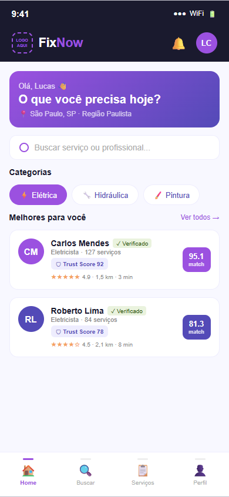
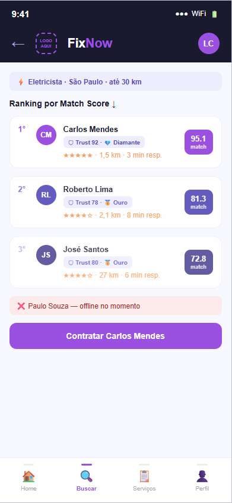
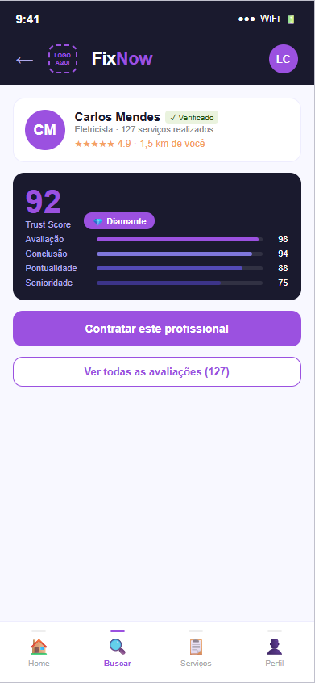
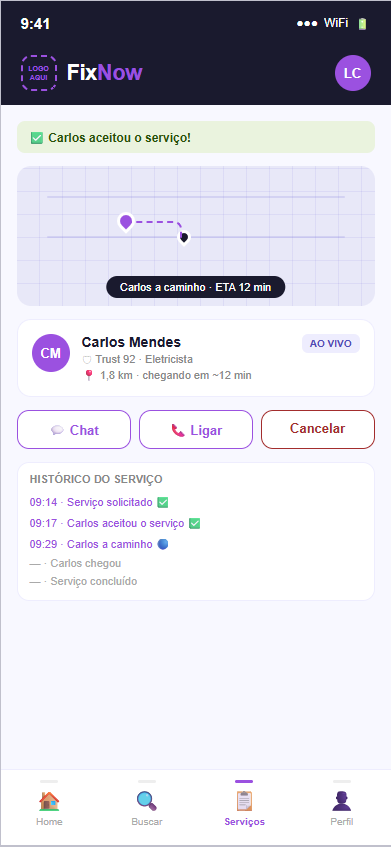
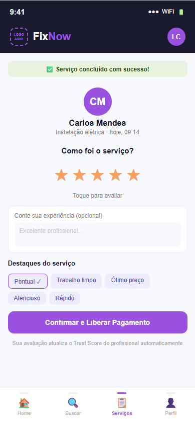

# FixNow 🔧

> Marketplace de serviços domésticos com segurança, qualificação verificada e rastreamento em tempo real.

[](https://python.org)
[](https://fastapi.tiangolo.com)
[](LICENSE)

---

## 📌 Sobre o Projeto

A **FixNow** é uma plataforma brasileira de marketplace de serviços domésticos (encanador, eletricista, pintor, diarista, entre outros), desenvolvida como TCC do MBA em Engenharia de Dados na FIAP — trilha Startup One.

### Problema que resolve

Usuários de plataformas como GetNinjas enfrentam:
- ❌ Falta de segurança nos pagamentos
- ❌ Profissionais sem qualificação verificada
- ❌ Sem rastreamento do profissional em tempo real
- ❌ Ausência de garantias após contratação

### Nossa solução

- ✅ **Trust Score** — score de confiabilidade calculado por dados reais
- ✅ **Pagamento seguro** — liberado apenas após conclusão do serviço (escrow)
- ✅ **Rastreamento em tempo real** — como Uber, mas para serviços domésticos
- ✅ **Algoritmo de matching com IA** — seleciona o melhor profissional automaticamente
- ✅ **Qualificação verificada** — documentos, certificados e histórico validados

---

## 🏗️ Arquitetura

```
Cliente (App) → API Gateway → FastAPI
                                ├── PostgreSQL (dados transacionais)
                                ├── Redis (cache + sessões)
                                ├── Kafka (streaming de eventos)
                                └── Data Lake → Data Warehouse → BI
```

### Pipeline de Dados

| Camada | Tecnologia | Função |
|---|---|---|
| Ingestão | Kafka + API Gateway | Captura eventos em tempo real |
| Armazenamento | PostgreSQL + S3 | OLTP + Data Lake |
| Processamento | Spark + Airflow | ETL e transformações |
| Consumo | Power BI + APIs | Dashboards e IA |

---

## 📱 Protótipo de Interface

Jornada completa do cliente na plataforma FixNow:

<div align="center">

| Home | Ranking Matching | Trust Score |
|------|-----------------|-------------|
|  |  |  |

| Rastreamento GPS | Pagamento Escrow | Avaliação |
|-----------------|-----------------|-----------|
|  |  |  |

</div>

## 🚀 Como rodar o projeto

### Pré-requisitos

- Python 3.11+
- Docker + Docker Compose
- Git

### Instalação

```bash
# 1. Clone o repositório
git clone https://github.com/Lucascosta-dbm/fixnow.git
cd fixnow

# 2. Copie o arquivo de variáveis de ambiente
cp .env.example .env
# Edite o .env com suas configurações

# 3. Suba os serviços com Docker
docker-compose up -d

# 4. Instale as dependências Python
pip install -e ".[dev]"

# 5. Execute as migrações
alembic upgrade head

# 6. Rode o servidor
uvicorn app.main:app --reload
```

### Acessos

| Serviço | URL |
|---|---|
| API | http://localhost:8000 |
| Documentação Swagger | http://localhost:8000/docs |
| Documentação Redoc | http://localhost:8000/redoc |

---

## 📁 Estrutura do Projeto

```
fixnow/
├── app/
│   ├── main.py              # Entry point da aplicação
│   ├── core/
│   │   ├── config.py        # Configurações e variáveis de ambiente
│   │   ├── database.py      # Conexão com banco de dados
│   │   └── security.py      # JWT e autenticação
│   ├── api/routes/          # Endpoints da API
│   ├── models/              # Modelos SQLAlchemy
│   ├── schemas/             # Schemas Pydantic (validação)
│   └── services/            # Lógica de negócio
├── openspec/                # Especificações e propostas (SDD)
├── tests/                   # Testes automatizados
├── docs/                    # Documentação técnica
├── AGENTS.md                # Instruções para agentes IA
└── docker-compose.yml       # Infraestrutura local
```

---

## 🧠 Algoritmo de Matching

O coração da plataforma é o algoritmo de seleção de profissionais:

```
Score = (0.30 × Proximidade) 
      + (0.25 × Avaliação) 
      + (0.20 × TrustScore) 
      + (0.15 × Disponibilidade) 
      + (0.10 × TempoResposta)
```

Isso garante que o usuário sempre receba o **melhor profissional disponível**, equilibrando rapidez, qualidade e confiabilidade.

---

## 📊 KPIs da Plataforma

| KPI | Fórmula |
|---|---|
| Tempo Médio de Atendimento (TMA) | Total de tempo / Serviços concluídos |
| Taxa de Cancelamento | (Cancelados / Total) × 100 |
| Taxa de Sucesso | (Concluídos / Total) × 100 |
| CSAT | Média das avaliações |
| Matching Rate | (Atendidos / Solicitados) × 100 |

---

## 👨‍💻 Autor

**Lucas Costa**  
MBA em Engenharia de Dados — FIAP  
GitHub: [@Lucascosta-dbm](https://github.com/Lucascosta-dbm)

---

## 📄 Licença

MIT License — veja [LICENSE](LICENSE) para detalhes.
